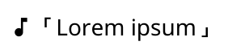

# BGMJS

A small, minimalist js for adding a simple background music player on your web page.

## Setup

### Preparing the files

First, upload the music files you want to play on your http server.

Next, an index file needs to be prepared for *BGMJS* to know what tracks to play.

The index should be a `JSON` array with each trach represented in the following syntax:
```
{
        "index": 1,               //unique id of the track
        "src": "lorem_ipsum.flac",//path to the audio file
        "name": "Lorem ipsum",    //Name to be displayed on the player
        "artist": "John Doe",     //track artist. This is to be diplayed on the browser media player.
        "album": "Lorem Ipsum"    //track album. This is to be diplayed on the browser media player.
},
```

Or, if you have th access to the server where the files are placed, the index can also be easily generated using a [python script](https://github.com/tonY1883/simple-play/blob/master/music-index.py) from another of my projects.

### Setting up the web page

Include *BGMJS* in yout web page HTML:
```html
<script src="https://tony1883.github.io/bgmjs/bgm.js"></script>
```
Then initialize the player during page load, passing path of the generated index file:

```html
<script>
  window.addEventListener("load", () => {
    new BGMPlayer({ indexPath: "index.json" });
  });
</script>
```

Enjoy the music on your site!

### Configurations

You can configure some aspects of the player by editing the paramters passed during the initialization: 

```typescript
interface BGMConfig {
  indexPath: string; //Path to index file, mandatory
  color?: string; //Color of the interface, optional
  autoplay?: boolean; //Enable playing when user interact with the page, optional. Default off.
  volumeSteps?: number; //Total steps of volume adjustments avilable, default 35. Optional.
}
```

## Controls



*BGMJS* provides basic playback controls. The design is to be minimalist, so the controls may be a bit unintuitive.

1. Click on the music note to mute/unmute the playback.
2. Click on the track name to play next track. (Randomly selected)
3. Scroll on the track name to adjust volume.

## Dependency

- _BGMJS_ uses Google's _Material Symbols_ to display the small music note icon in the player.
- Other than that, it has no real dependency.
